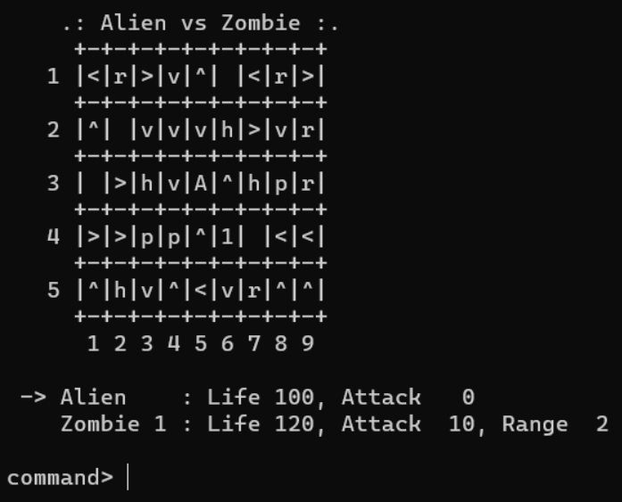

# Alien vs. Zombie




YouTube link: [Video Demo](https://www.youtube.com/watch?v=DGAXANWANtw).

## Compilation Instructions

```
g++ main.cpp
```

## User Manual
Alien vs Zombie is a turn-based combat game in which the player controls Alien to defeat a group of Zombies.

```
     +-+-+-+-+-+-+-+-+-+
   1 |>| |v|v|>|1|^|r|h|
     +-+-+-+-+-+-+-+-+-+
   2 |r| |v|^|h|<| | |h|
     +-+-+-+-+-+-+-+-+-+
   3 |^|<|^|>|A|p|h|^|<|
     +-+-+-+-+-+-+-+-+-+
   4 |p|>|p|p|r|<| | |h|
     +-+-+-+-+-+-+-+-+-+
   5 |h| |>|<|h| |h|r|<|
     +-+-+-+-+-+-+-+-+-+
      1 2 3 4 5 6 7 8 9
```

You can set the dimension of the board by yourself.
By default, the board is in dimension 5 x 9.

```
     +-+-+-+-+-+-+-+-+-+
   1 |>| |v|v|>|1|^|r|h|
     +-+-+-+-+-+-+-+-+-+
   2 |r| |v|^|h|<| | |h|
     +-+-+-+-+-+-+-+-+-+
   3 |^|<|^|>|A|p|h|^|<|
     +-+-+-+-+-+-+-+-+-+
   4 |p|>|p|p|r|<| | |h|
     +-+-+-+-+-+-+-+-+-+
   5 |h| |>|<|h| |h|r|<|
     +-+-+-+-+-+-+-+-+-+
      1 2 3 4 5 6 7 8 9
```

Alphabet A in the middle is representing Alien.
Number is representing Zombie.
All the elements inside the board called objects.

```
Object:
+---------+-----------------------------------------------------------------------+
|Name     |Appearance        |Description                                         |
+---------+-----------------------------------------------------------------------+
|Arrow    |^(up), v(down)    |- Changes Alien's direction of movement.            |
|         |<(left), >(right) |- Adds 20 attack to Alien.                          |
+---------+-----------------------------------------------------------------------+
|Health   |h                 |- Adds 20 life to Alien.                            |
+---------+-----------------------------------------------------------------------+
|Pod      |p                 |- Instantly inflicts 10 damage to Zombie when hit by|
|         |                  |  Alien.                                            |
+---------+-----------------------------------------------------------------------+
|Rock     |r                 |- Hides a game object (except Rock and Trail)       |
|         |                  |  beneath it.                                       |
|         |                  |- Reveals the hidden game object when hit by Alien. |
|         |                  |- Stops the Alien from moving.                      |
+---------+-----------------------------------------------------------------------+
|Empty    |Space             |- Just an empty space on the board.                 |
+---------+-----------------------------------------------------------------------+
|Trail    |.                 |- Left by Alien when it moves.                      |
|         |                  |- Reset to a random game object (except the Trail   |
|         |                  |  after Alien's turn ends.                          |
+---------+-----------------------------------------------------------------------+
```

```
     +-+-+-+-+-+-+-+-+-+
   1 |>| |v|v|>|1|^|r|h|
     +-+-+-+-+-+-+-+-+-+
   2 |r| |v|^|h|<| | |h|
     +-+-+-+-+-+-+-+-+-+
   3 |^|<|^|>|A|p|h|^|<|
     +-+-+-+-+-+-+-+-+-+
   4 |p|>|p|p|r|<| | |h|
     +-+-+-+-+-+-+-+-+-+
   5 |h| |>|<|h| |h|r|<|
     +-+-+-+-+-+-+-+-+-+
      1 2 3 4 5 6 7 8 9

 -> Alien    : Life 100, Attack   0
    Zombie 1 : Life 200, Attack  15, Range  4

command>
```

The lines after the board are showing all the attributes of Alien and Zombies.
The arrow in front of Alien is indicating the turn of Alien in this moment.
'command>' is the line that let user to give command to the Alien.

```
Command:
+-------------------+-------------------------------------------------------------+
|Command            |Description                                                  |
+-------------------+-------------------------------------------------------------+
|up                 |- Alien to move up.                                          |
+-------------------+-------------------------------------------------------------+
|down               |- Alien to move down.                                        |
+-------------------+-------------------------------------------------------------+
|left               |- Alien to move left.                                        |
+-------------------+-------------------------------------------------------------+
|right              |- Alien to move right.                                       |
+-------------------+-------------------------------------------------------------+
|arrow              |- Switch the direction of an arrow object in the game board  |
|                   |  (The player will be asked to enter the row and column of   |
|                   |  the arrow object to switch, followed by the direction of   |
|                   |  the arrow object to switch to.)                            |
+-------------------+-------------------------------------------------------------+
|help               |- List and describe the commands that the player can use in  |
|                   |  the game.                                                  |
+-------------------+-------------------------------------------------------------+
|save               |- Save the current game to a file.                           |
|                   |  (The player will be asked to enter the name of the file to |
|                   |  save to.)                                                  |
+-------------------+-------------------------------------------------------------+
|load               |- Load a saved game from a file.                             |
|                   |  (The player will be asked to enter the name of the file to |
|                   |  load from.)                                                |
+-------------------+-------------------------------------------------------------+
|quit               |- Quit the game while still in play.                         |
|                   |  (The player will be asked to confirm his/her decision.)    |
+-------------------+-------------------------------------------------------------+
```

```
     +-+-+-+-+-+-+-+-+-+
   1 |>| |v|v|>|1|^|r|h|
     +-+-+-+-+-+-+-+-+-+
   2 |r| |v|^|h|<| | |h|
     +-+-+-+-+-+-+-+-+-+
   3 |^|<|^|>|A|p|h|^|<|
     +-+-+-+-+-+-+-+-+-+
   4 |p|>|p|p|r|<| | |h|
     +-+-+-+-+-+-+-+-+-+
   5 |h| |>|<|h| |h|r|<|
     +-+-+-+-+-+-+-+-+-+
      1 2 3 4 5 6 7 8 9

 -> Alien    : Life 100, Attack   0
    Zombie 1 : Life 200, Attack  15, Range  4

command> right
```

Let say user input right, the Alien will move to the right continuously afterwards.

```
     +-+-+-+-+-+-+-+-+-+
   1 |>| |v|v|>|1|^|r|h|
     +-+-+-+-+-+-+-+-+-+
   2 |r| |v|^|h|<| | |h|
     +-+-+-+-+-+-+-+-+-+
   3 |^|<|^|>|A|p|h|^|<|
     +-+-+-+-+-+-+-+-+-+
   4 |p|>|p|p|r|<| | |h|
     +-+-+-+-+-+-+-+-+-+
   5 |h| |>|<|h| |h|r|<|
     +-+-+-+-+-+-+-+-+-+
      1 2 3 4 5 6 7 8 9

 -> Alien    : Life 100, Attack   0
    Zombie 1 : Life 200, Attack  15, Range  4

Alien finds a pod.
Zombie 1 receives a damage of 10.
Zombie 1 is still alive.
```
The screen will output what object the Alien found and what will be
happening before the position of Alien changes in the board.
In this situation, Alien found a pod and the nearest zombie will receive a damage of 10.

```
     +-+-+-+-+-+-+-+-+-+
   1 |>| |v|v|>|1|^|r|h|
     +-+-+-+-+-+-+-+-+-+
   2 |r| |v|^|h|<| | |h|
     +-+-+-+-+-+-+-+-+-+
   3 |^|<|^|>|.|A|h|^|<|
     +-+-+-+-+-+-+-+-+-+
   4 |p|>|p|p|r|<| | |h|
     +-+-+-+-+-+-+-+-+-+
   5 |h| |>|<|h| |h|r|<|
     +-+-+-+-+-+-+-+-+-+
      1 2 3 4 5 6 7 8 9

 -> Alien    : Life 100, Attack   0
    Zombie 1 : Life 190, Attack  15, Range  4

Alien finds a health pack.
Alien's life increased by 20.
```
The initial position of Alien become a dot which is indicating the Trail.
Now Alien found a health pack and Alien's life increased by 20,
since Alien life is full, Alien's life remain the same.

```
     +-+-+-+-+-+-+-+-+-+
   1 |>| |v|v|>|1|^|r|h|
     +-+-+-+-+-+-+-+-+-+
   2 |r| |v|^|h|<| | |h|
     +-+-+-+-+-+-+-+-+-+
   3 |^|<|^|>|.|.|A|^|<|
     +-+-+-+-+-+-+-+-+-+
   4 |p|>|p|p|r|<| | |h|
     +-+-+-+-+-+-+-+-+-+
   5 |h| |>|<|h| |h|r|<|
     +-+-+-+-+-+-+-+-+-+
      1 2 3 4 5 6 7 8 9

 -> Alien    : Life 100, Attack   0
    Zombie 1 : Life 190, Attack  15, Range  4

Alien finds an arrow.
Alien's attack is increased by 20.
```
Alien's initial attack is always 0 unless it found an arrow. The more arrow it found, the more attack it got.
Alien direction will also be changed.
Note!!! The Alien's attack will become 0 once its turn over

```
     +-+-+-+-+-+-+-+-+-+
   1 |>| |v|v|>|1|^|r|h|
     +-+-+-+-+-+-+-+-+-+
   2 |r| |v|^|h|<| | |h|
     +-+-+-+-+-+-+-+-+-+
   3 |^|<|^|>|.|.|.|A|<|
     +-+-+-+-+-+-+-+-+-+
   4 |p|>|p|p|r|<| | |h|
     +-+-+-+-+-+-+-+-+-+
   5 |h| |>|<|h| |h|r|<|
     +-+-+-+-+-+-+-+-+-+
      1 2 3 4 5 6 7 8 9

 -> Alien    : Life 100, Attack  20
    Zombie 1 : Life 190, Attack  15, Range  4

Alien finds an empty space.
```
Alien is moving up now
Alien found an empty space, nothing happen.
```
     +-+-+-+-+-+-+-+-+-+
   1 |>| |v|v|>|1|^|r|h|
     +-+-+-+-+-+-+-+-+-+
   2 |r| |v|^|h|<| |A|h|
     +-+-+-+-+-+-+-+-+-+
   3 |^|<|^|>|.|.|.|.|<|
     +-+-+-+-+-+-+-+-+-+
   4 |p|>|p|p|r|<| | |h|
     +-+-+-+-+-+-+-+-+-+
   5 |h| |>|<|h| |h|r|<|
     +-+-+-+-+-+-+-+-+-+
      1 2 3 4 5 6 7 8 9

 -> Alien    : Life 100, Attack  20
    Zombie 1 : Life 190, Attack  15, Range  4

Alien stumbles upon a rock.
Alien discover a pod beneath the rock.
```
Alien found a rock, and force it stop moving.
The rock will reveals any other random object.

```
     +-+-+-+-+-+-+-+-+-+
   1 |>| |v|v|>|1|^|p|h|
     +-+-+-+-+-+-+-+-+-+
   2 |r| |v|^|h|<| |A|h|
     +-+-+-+-+-+-+-+-+-+
   3 |^|<|^|>|.|.|.|.|<|
     +-+-+-+-+-+-+-+-+-+
   4 |p|>|p|p|r|<| | |h|
     +-+-+-+-+-+-+-+-+-+
   5 |h| |>|<|h| |h|r|<|
     +-+-+-+-+-+-+-+-+-+
      1 2 3 4 5 6 7 8 9

 -> Alien    : Life 100, Attack  20
    Zombie 1 : Life 190, Attack  15, Range  4

Alien turn end. The trail is reset.
```
Alien turn end. Zombie 1 turn.
Zombie will move to any 1 of 4 direction.
After moving, if the distance between Alien and Zombie is within the Zombie's Range,
Zombie will attack Alien, else Zombie turn end.
```
     +-+-+-+-+-+-+-+-+-+
   1 |>| |v|v|>|1|^|p|h|
     +-+-+-+-+-+-+-+-+-+
   2 |r| |v|^|h|<| |A|h|
     +-+-+-+-+-+-+-+-+-+
   3 |^|<|^|>| |h|>| |<|
     +-+-+-+-+-+-+-+-+-+
   4 |p|>|p|p|r|<| | |h|
     +-+-+-+-+-+-+-+-+-+
   5 |h| |>|<|h| |h|r|<|
     +-+-+-+-+-+-+-+-+-+
      1 2 3 4 5 6 7 8 9

    Alien    : Life 100, Attack  20
 -> Zombie 1 : Life 190, Attack  15, Range  4

Zombie 1 moves down.
```
Zombie 1 randomly assigned to move down.

```
     +-+-+-+-+-+-+-+-+-+
   1 |>| |v|v|>| |^|p|h|
     +-+-+-+-+-+-+-+-+-+
   2 |r| |v|^|h|1| |A|h|
     +-+-+-+-+-+-+-+-+-+
   3 |^|<|^|>| |h|>| |<|
     +-+-+-+-+-+-+-+-+-+
   4 |p|>|p|p|r|<| | |h|
     +-+-+-+-+-+-+-+-+-+
   5 |h| |>|<|h| |h|r|<|
     +-+-+-+-+-+-+-+-+-+
      1 2 3 4 5 6 7 8 9

    Alien    : Life 100, Attack  20
 -> Zombie 1 : Life 190, Attack  15, Range  4

Zombie 1 attacks Alien.
Alien receives a damage of 15.
Alien is still alive.
```
Since the distance between Alien and Zombie 1 is only 1 which is within 4,
Zombie 1 will attack Alien with attack of 15.
```
     +-+-+-+-+-+-+-+-+-+
   1 |>| |v|v|>| |^|p|h|
     +-+-+-+-+-+-+-+-+-+
   2 |r| |v|^|h|1| |A|h|
     +-+-+-+-+-+-+-+-+-+
   3 |^|<|^|>| |h|>| |<|
     +-+-+-+-+-+-+-+-+-+
   4 |p|>|p|p|r|<| | |h|
     +-+-+-+-+-+-+-+-+-+
   5 |h| |>|<|h| |h|r|<|
     +-+-+-+-+-+-+-+-+-+
      1 2 3 4 5 6 7 8 9

    Alien    : Life 85 , Attack  20
 -> Zombie 1 : Life 190, Attack  15, Range  4

Zombie 1's turn ends.
```
Zombie 1's turn ends, now back to Alien's turn

```
     +-+-+-+-+-+-+-+-+-+
   1 |>| |v|v|>| |^|p|h|
     +-+-+-+-+-+-+-+-+-+
   2 |r| |v|^|h|1| |A|h|
     +-+-+-+-+-+-+-+-+-+
   3 |^|<|^|>| |h|>| |<|
     +-+-+-+-+-+-+-+-+-+
   4 |p|>|p|p|r|<| | |h|
     +-+-+-+-+-+-+-+-+-+
   5 |h| |>|<|h| |h|r|<|
     +-+-+-+-+-+-+-+-+-+
      1 2 3 4 5 6 7 8 9

 -> Alien    : Life 85 , Attack  20
    Zombie 1 : Life 190, Attack  15, Range  4

command>
```
You can also change the direction of the arrow.
To do that, you need to input arrow.

```
     +-+-+-+-+-+-+-+-+-+
   1 |>| |v|v|>| |^|p|h|
     +-+-+-+-+-+-+-+-+-+
   2 |r| |v|^|h|1| |A|h|
     +-+-+-+-+-+-+-+-+-+
   3 |^|<|^|>| |h|>| |<|
     +-+-+-+-+-+-+-+-+-+
   4 |p|>|p|p|r|<| | |h|
     +-+-+-+-+-+-+-+-+-+
   5 |h| |>|<|h| |h|r|<|
     +-+-+-+-+-+-+-+-+-+
      1 2 3 4 5 6 7 8 9

 -> Alien    : Life 85 , Attack  20
    Zombie 1 : Life 190, Attack  15, Range  4

command> arrow
```

```
     +-+-+-+-+-+-+-+-+-+
   1 |>| |v|v|>| |^|p|h|
     +-+-+-+-+-+-+-+-+-+
   2 |r| |v|^|h|1| |A|h|
     +-+-+-+-+-+-+-+-+-+
   3 |^|<|^|>| |h|>| |<|
     +-+-+-+-+-+-+-+-+-+
   4 |p|>|p|p|r|<| | |h|
     +-+-+-+-+-+-+-+-+-+
   5 |h| |>|<|h| |h|r|<|
     +-+-+-+-+-+-+-+-+-+
      1 2 3 4 5 6 7 8 9

 -> Alien    : Life 85 , Attack  20
    Zombie 1 : Life 190, Attack  15, Range  4

command> arrow
Enter row, column, direction:
```
Enter the row, column and direction that you want.
Let say you want to change the arrow at (1,1) to down.
```
     +-+-+-+-+-+-+-+-+-+
   1 |>| |v|v|>| |^|p|h|
     +-+-+-+-+-+-+-+-+-+
   2 |r| |v|^|h|1| |A|h|
     +-+-+-+-+-+-+-+-+-+
   3 |^|<|^|>| |h|>| |<|
     +-+-+-+-+-+-+-+-+-+
   4 |p|>|p|p|r|<| | |h|
     +-+-+-+-+-+-+-+-+-+
   5 |h| |>|<|h| |h|r|<|
     +-+-+-+-+-+-+-+-+-+
      1 2 3 4 5 6 7 8 9

 -> Alien    : Life 85 , Attack  20
    Zombie 1 : Life 190, Attack  15, Range  4

command> arrow
Enter row, column, direction: 1 1 down
```
The format you need to type is as shown above.

```
     +-+-+-+-+-+-+-+-+-+
   1 |>| |v|v|>| |^|p|h|
     +-+-+-+-+-+-+-+-+-+
   2 |r| |v|^|h|1| |A|h|
     +-+-+-+-+-+-+-+-+-+
   3 |^|<|^|>| |h|>| |<|
     +-+-+-+-+-+-+-+-+-+
   4 |p|>|p|p|r|<| | |h|
     +-+-+-+-+-+-+-+-+-+
   5 |h| |>|<|h| |h|r|<|
     +-+-+-+-+-+-+-+-+-+
      1 2 3 4 5 6 7 8 9

 -> Alien    : Life 85 , Attack  20
    Zombie 1 : Life 190, Attack  15, Range  4

command> arrow
Enter row, column, direction: 1 1 down
Arrow > is switch to v.
```
```
     +-+-+-+-+-+-+-+-+-+
   1 |v| |v|v|>| |^|p|h|
     +-+-+-+-+-+-+-+-+-+
   2 |r| |v|^|h|1| |A|h|
     +-+-+-+-+-+-+-+-+-+
   3 |^|<|^|>| |h|>| |<|
     +-+-+-+-+-+-+-+-+-+
   4 |p|>|p|p|r|<| | |h|
     +-+-+-+-+-+-+-+-+-+
   5 |h| |>|<|h| |h|r|<|
     +-+-+-+-+-+-+-+-+-+
      1 2 3 4 5 6 7 8 9

 -> Alien    : Life 85 , Attack  20
    Zombie 1 : Life 190, Attack  15, Range  4

command>
```
In short, you need to change the arrow, so you can collect the arrow as many as possible and hits
the zombie until all the zombie is defeated.

That's the end of this guideline, let's defeat the Zombie now!!!

## Progress Log

- [Part 1](PART1.md)
- [Part 2](PART2.md)

## Contributors

Please replace the following with your group members' names. 

- Law Chin Keat
- Lo Pei Qin
- Ho Tsi Qi


